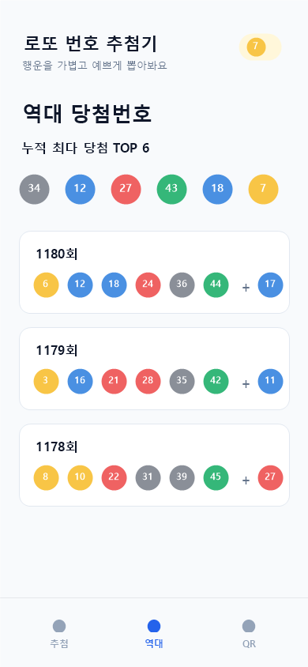
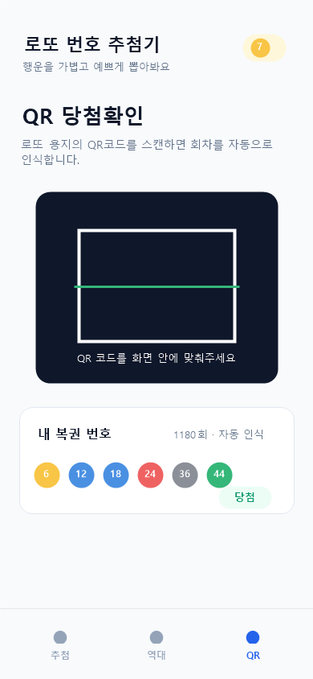

# Lotto Number Picker

깔끔한 UI로 로또 번호를 추첨하고, 역대 당첨번호와 QR 당첨 확인까지 한 번에 사용할 수 있는 React Native 앱입니다.

## Screenshots

<p align="center">
  
  
  
</p>

## Features

- 1부터 45까지 중복 없는 로또 번호 6개 랜덤 추첨
- 실제 로또 번호 구간별 색상을 반영한 번호 UI
- 회차별 역대 당첨번호 및 보너스 번호 조회
- 누적 최다 당첨 번호 TOP 6 표시
- 로또 QR코드 스캔을 통한 회차 및 번호 자동 인식
- 내 복권 번호와 실제 당첨번호 비교
- Android 및 iOS 대응 가능한 Expo 기반 구조

## Tech Stack

- Expo
- React Native
- JavaScript
- Expo Camera
- React Native Safe Area Context

## Getting Started

```bash
npm install
npx expo start -c
```

개발 빌드 환경에서 실행하려면 다음 명령어를 사용합니다.

```bash
npm run start:dev
```

## Android Build

테스트 설치용 APK:

```bash
npm run build:android:apk
```

Google Play 등록용 AAB:

```bash
npm run build:android:aab
```

빌드 결과물은 `release-outputs/` 폴더에 생성됩니다.

## Project Structure

```text
.
├── App.js
├── app.config.js
├── app.json
├── assets/
│   ├── icon.png
│   └── screenshots/
├── docs/
│   └── index.html
├── scripts/
│   └── build-android-release.ps1
├── package.json
└── README.md
```

## Privacy Policy

개인정보처리방침은 GitHub Pages 배포를 위해 `docs/` 폴더에 포함되어 있습니다.

## Note

본 프로젝트는 포트폴리오 및 학습 목적의 모바일 앱입니다. 추첨 결과는 무작위이며 실제 당첨을 보장하지 않습니다.
